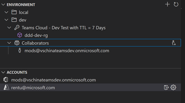
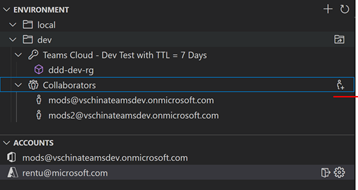

## Collaborating on TeamsFx Project
The previous version of Teams Toolkit is not easy for multiple users to develop the same project due to missing privilege to access Teams APP and AAD APP for another developer. If multiple developers want to share remote resources and work together, they need to manually handle permissions for Teams App and AAD APP which need deep understanding the low-level details about the TeamsFx project.


Latest version of Teams Toolkit now natively support add other collaborators for TeamsFx project which is much easy and straightforward for collaborative development.


## Collaborating - Use VSCode

### Creator
- Open VSCode, create a new TeamsFx Tab project (You can also select bot), and the hosting type select Azure

- Login M365 account and Azure account

- Provision and deploy your project, after provision success, you will see your m365 account listing below Collaborators node in Teams Toolkit panel

    

-	Add another account as collaborator from tree view by click the grant permission button. Note that the added account must under the same tenant
  
    

- Push your project to GitHub

### Collaborator
- Clone the project from GitHub
-	Login M365 account use collaborator’s account
-	Login Azure account which has contributor permission for all the Azure resources
-	Update Tab code, and deploy the project to remote
-	Launch remote and the project should work fine


## Collaborating - Use CLI
Teams Toolkit CLI provides `teamsFx permission` Commands for collaboration scenario.

### Commands
| `teamsFx permission` Commands | Descriptions |
|:------------------------------|-------------|
| `teamsfx permission grant` | Grant permission for collaborator's M365 account for the project |
| `teamsfx permission status` | Show permission status for the project | 

***

### Parameters for `teamsfx permission grant`
#### `--env`
**(Required)** Provide env name.

#### `--email`
**(Required)** Provide collaborator's M365 email address. Note that the collaborators's account should be in the same tenant with creator.

### Parameters for `teamsfx permission status`
#### `--env`
**(Required)** Provide env name.

#### `--list-all-collaborators`
With this flag, Teams Toolkit CLI will print out all collaborators for this project.

## Examples
Here are some examples for you to better handling permission for `TeamsFx` projects.

### Grant Permission
```bash
teamsfx permission grant --env dev --email user-email@user-tenant.com
```

### Show Permission Status
```bash
teamsfx permission status --env dev
```

### List All Collaborators
```bash
teamsfx permission status --env dev --list-all-collaborators
```

